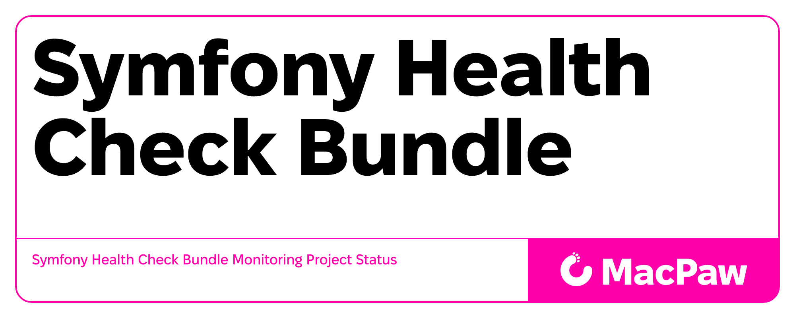

Symfony Health Check Bundle
=================================

| Version | Build Status | Code Coverage |
|:---------:|:-------------:|:-----:|
| `master`| [![CI][master Build Status Image]][master Build Status] | [![Coverage Status][master Code Coverage Image]][master Code Coverage] |
| `develop`| [![CI][develop Build Status Image]][develop Build Status] | [![Coverage Status][develop Code Coverage Image]][develop Code Coverage] |

Installation
============

Step 1: Download the Bundle
----------------------------------
Open a command console, enter your project directory and execute:

```console
composer require macpaw/symfony-health-check-bundle
```

### Applications that don't use Symfony Flex

enable the bundle by adding it to the list of registered bundles in config/bundles.php

```php
// config/bundles.php
<?php

return [
            SymfonyHealthCheckBundle\SymfonyHealthCheckBundle::class => ['all' => true],

        // ...
    ];
```

Create Symfony Health Check Bundle Config:
----------------------------------

> **Note:** XML configuration is no longer supported. Please use YAML or PHP configuration format in your project.

Configurating health check - all available you can see [here](https://github.com/MacPaw/symfony-health-check-bundle/tree/master/src/Check).

```yaml
# config/packages/symfony_health_check.yaml`



symfony_health_check:
    health_checks:
        - id: symfony_health_check.doctrine_orm_check
    ping_checks:
        - id: symfony_health_check.status_up_check
```
To perform redis check you need use provide its dsn in the config:
```yaml
symfony_health_check:
    health_checks:
        ...
        - id: symfony_health_check.redis_check

    redis_dsn: 'redis://localhost:6379'
```

Change response code:
- default response code is 200.
- determine your custom response code in case of some check fails (Response code must be a valid HTTP status code)
```yaml
symfony_health_check:
    health_checks:
        - id: symfony_health_check.doctrine_orm_check
    ping_checks:
        - id: symfony_health_check.status_up_check
    ping_error_response_code: 500
    health_error_response_code: 404
```

Create Symfony Health Check Bundle Routing Config:
----------------------------------
`config/routes/symfony_health_check.yaml`

```yaml
health_check:
    resource: '@SymfonyHealthCheckBundle/Resources/config/routes.php'
```

Step 3: Configuration
=============

Security Optional:
----------------------------------

If you are using [symfony/security](https://symfony.com/doc/current/security.html) and your health check is to be used anonymously, add a new firewall to the configuration

```yaml
# config/packages/security.yaml
    firewalls:
        healthcheck:
            pattern: ^/health
            security: false
        ping:
            pattern: ^/ping
            security: false
```

Step 4: Additional settings
=============

Add Custom Check:
----------------------------------
It is possible to add your custom health check:

```php
<?php

declare(strict_types=1);

namespace YourProject\Check;

use SymfonyHealthCheckBundle\Dto\Response;

class CustomCheck implements CheckInterface
{
    public function check(): Response
    {
        return new Response('status', true, 'up');
    }
}
```

Then we add our custom health check to collection

```yaml
symfony_health_check:
    health_checks:
        - id: symfony_health_check.doctrine_orm_check
        - id: custom_health_check // custom service check id
```

How Change Route:
----------------------------------
You can change the default behavior with a light configuration, remember to modify the routes.
```yaml
# config/routes/symfony_health_check.yaml
health:
    path: /your/custom/url
    methods: GET
    controller: SymfonyHealthCheckBundle\Controller\HealthController::check
    
ping:
    path: /your/custom/url
    methods: GET
    controller: SymfonyHealthCheckBundle\Controller\PingController::check

```

Rate Limiting (Optional):
----------------------------------

To protect your health check endpoints from abuse, you can enable rate limiting. This feature requires the `symfony/rate-limiter` package:

```console
composer require symfony/rate-limiter
```

Configure rate limiting in your bundle config:

```yaml
# config/packages/symfony_health_check.yaml
symfony_health_check:
    health_checks:
        - id: symfony_health_check.doctrine_orm_check
    ping_checks:
        - id: symfony_health_check.status_up_check

    rate_limiter:
        enabled: true
        health:
            enabled: true
            policy: 'fixed_window'   # or 'sliding_window', 'token_bucket'
            limit: 100               # max requests
            interval: '60 minutes'   # time window
        ping:
            enabled: true
            policy: 'fixed_window'
            limit: 200
            interval: '60 minutes'
```

When rate limit is exceeded, the endpoint returns HTTP 429 (Too Many Requests) with the following headers:
- `X-RateLimit-Remaining`: remaining requests in current window
- `X-RateLimit-Retry-After`: seconds until the limit resets
- `X-RateLimit-Limit`: maximum requests allowed

Available policies:
- `fixed_window`: Simple counter that resets after the interval
- `sliding_window`: More accurate rate limiting using a sliding time window
- `token_bucket`: Allows bursts while maintaining average rate

How To Use Healthcheck In Docker
----------------------------------
```dockerfile
HEALTHCHECK --start-period=15s --interval=5s --timeout=3s --retries=3 CMD curl -sS {{your host}}/health || exit 1
```

[master Build Status]: https://github.com/macpaw/symfony-health-check-bundle/actions?query=workflow%3ACI+branch%3Amaster
[master Build Status Image]: https://github.com/macpaw/symfony-health-check-bundle/workflows/CI/badge.svg?branch=master
[develop Build Status]: https://github.com/macpaw/symfony-health-check-bundle/actions?query=workflow%3ACI+branch%3Adevelop
[develop Build Status Image]: https://github.com/macpaw/symfony-health-check-bundle/workflows/CI/badge.svg?branch=develop
[master Code Coverage]: https://codecov.io/gh/macpaw/symfony-health-check-bundle/branch/master
[master Code Coverage Image]: https://img.shields.io/codecov/c/github/macpaw/symfony-health-check-bundle/master?logo=codecov
[develop Code Coverage]: https://codecov.io/gh/macpaw/symfony-health-check-bundle/branch/develop
[develop Code Coverage Image]: https://img.shields.io/codecov/c/github/macpaw/symfony-health-check-bundle/develop?logo=codecov
